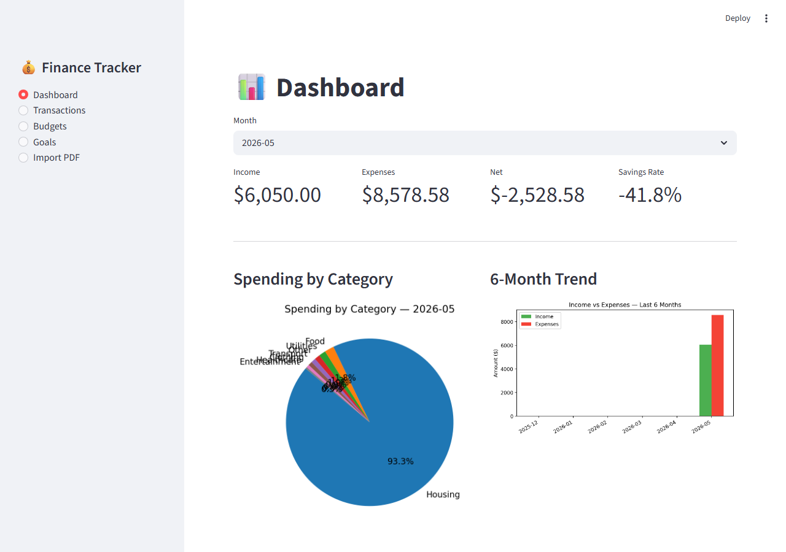

# Personal Finance Tracker

A personal finance tracker with both a browser-based GUI (Streamlit) and a terminal CLI (Rich).



## Features

- **Income & expense tracking** — log transactions with categories and dates
- **PDF statement import** — upload a bank statement PDF and categorize each transaction interactively
- **Budgets** — set monthly spending limits per category with over-budget warnings
- **Savings goals** — track progress toward financial goals with deadlines
- **Reports & charts** — monthly summaries, spending breakdowns, and 6-month income vs. expense bar charts

## Requirements

- Python 3.10+
- [pandas](https://pandas.pydata.org/) — data manipulation for reports
- [matplotlib](https://matplotlib.org/) — spending and income/expense charts
- [rich](https://github.com/Textualize/rich) — terminal UI, tables, and prompts
- [pdfplumber](https://github.com/jsvine/pdfplumber) — PDF text extraction for statement import
- [streamlit](https://streamlit.io/) — browser-based GUI

## Installation

```bash
pip install -r requirements.txt
```

## Usage

### GUI (browser)

```bash
python -m streamlit run app.py
```

Opens automatically at `http://localhost:8501`. All features are available through the sidebar: Dashboard, Transactions, Budgets, Goals, and Import PDF.

### CLI (terminal)

```bash
python main.py
```

> **Windows users:** if you see Unicode errors in the terminal, run with UTF-8 mode:
> ```bash
> python -X utf8 main.py
> ```

Both interfaces share the same data files, so transactions added in one are immediately visible in the other.

## PDF Import

Choose **Import PDF statement** from the main menu and provide the path to your bank statement PDF. The app will detect transactions and walk you through categorizing each one as income or expense before saving them.

PDF parsing uses regex to find lines containing a date and a dollar amount. Results vary by bank format — all fields (date, description, amount) are editable before saving.
